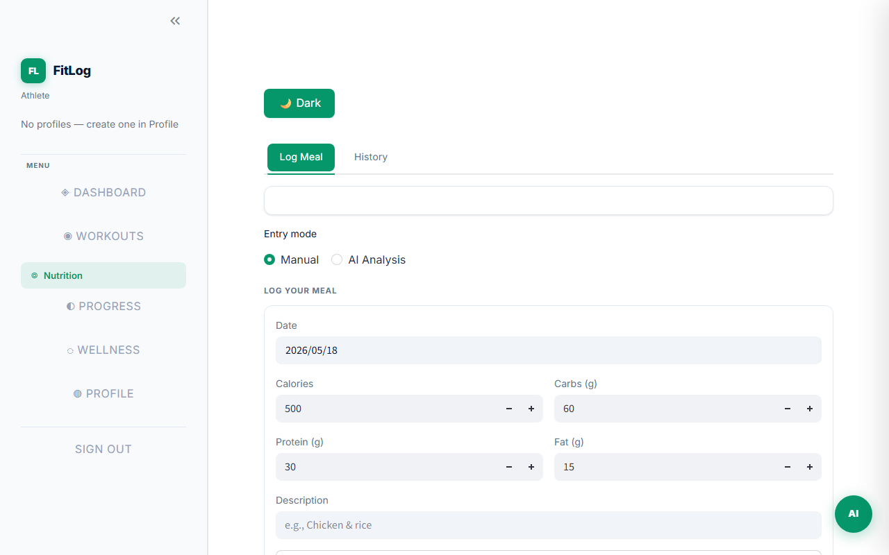

# FitLog

Personal fitness and nutrition tracking app — log workouts, meals, sleep, hydration, and body metrics in one place, with an AI coach powered by Groq.

**Stack:** FastAPI · SQLite · Streamlit · Groq (Llama 3.3 70B) · Redis (optional)

---

## Screenshots

| Login | Dashboard |
|---|---|
|  |  |

| Workouts | Nutrition |
|---|---|
|  |  |

| Wellness | My Progress |
|---|---|
|  |  |

---

## Quick Start

### Requirements

- Python 3.12+
- [`uv`](https://docs.astral.sh/uv/) — `pip install uv`
- A free [Groq API key](https://console.groq.com)

### 1. Clone & install

```bash
git clone <repo-url>
cd FitLog
uv sync
```

### 2. Configure

```bash
cp .env.example .env
```

Edit `.env` and set these two values:

```dotenv
SECRET_KEY=<generate with: python -c "import secrets; print(secrets.token_hex(32))">
GROQ_API_KEY=gsk_your_key_here
```

Everything else has working defaults.

### 3. Start the backend

```bash
uv run uvicorn app.main:app --reload
```

API runs at **http://localhost:8000** — interactive docs at **/docs**

### 4. Start the frontend *(separate terminal)*

```bash
uv run streamlit run frontend/app.py
```

Dashboard at **http://localhost:8501**

---

## Docker Compose

Runs the full stack (API + frontend + Redis) with one command.

```bash
cp .env.example .env        # set SECRET_KEY and GROQ_API_KEY
docker compose up -d
```

| Service | URL |
|---|---|
| Frontend | http://localhost:8501 |
| API | http://localhost:8000 |
| API docs | http://localhost:8000/docs |

---

## Environment Variables

| Variable | Required | Default | Description |
|---|---|---|---|
| `SECRET_KEY` | yes | — | JWT signing key (min 32 chars) |
| `GROQ_API_KEY` | yes | — | Groq API key |
| `DATABASE_URL` | no | `sqlite+aiosqlite:///./fitlog.db` | DB connection string |
| `REDIS_URL` | no | `redis://localhost:6379/0` | Redis URL (falls back to in-memory) |
| `ACCESS_TOKEN_EXPIRE_MINUTES` | no | `1440` | Token lifetime (24 h) |
| `GROQ_MODEL` | no | `llama-3.3-70b-versatile` | Groq model ID |

---

## Key Files

```
FitLog/
├── app/
│   ├── main.py              # FastAPI app entry point
│   ├── db.py                # Database table definitions
│   ├── models.py            # Request / response schemas
│   ├── security.py          # JWT + bcrypt
│   └── routers/             # One file per feature area
│       ├── auth.py          # Register, login, refresh token
│       ├── workout_logs.py  # Log sets / reps / weight
│       ├── macros.py        # Log meals + AI food analysis
│       ├── analytics.py     # Progress charts & summaries
│       ├── ai_assistant.py  # AI coach chat endpoint
│       └── ...              # sleep, hydration, steps, etc.
├── frontend/
│   └── app.py               # Streamlit dashboard (all pages)
├── tests/                   # pytest suite (in-memory DB)
├── .env.example             # Environment variable template
├── Dockerfile               # Backend image
├── Dockerfile.frontend      # Frontend image
└── compose.yaml             # Docker Compose stack
```

---

## Running Tests

```bash
uv run pytest tests/ -v
```
