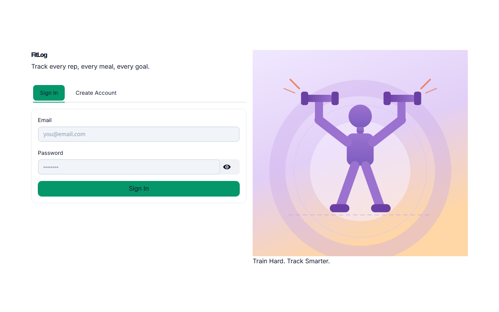
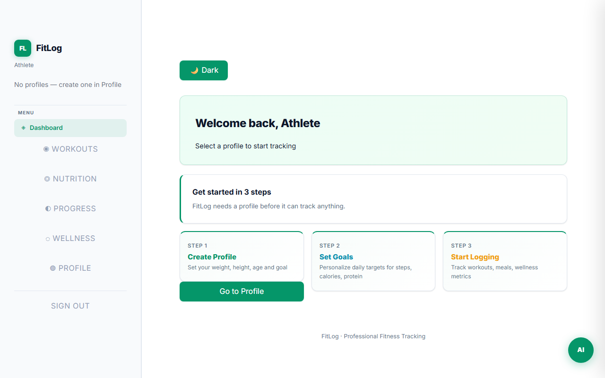
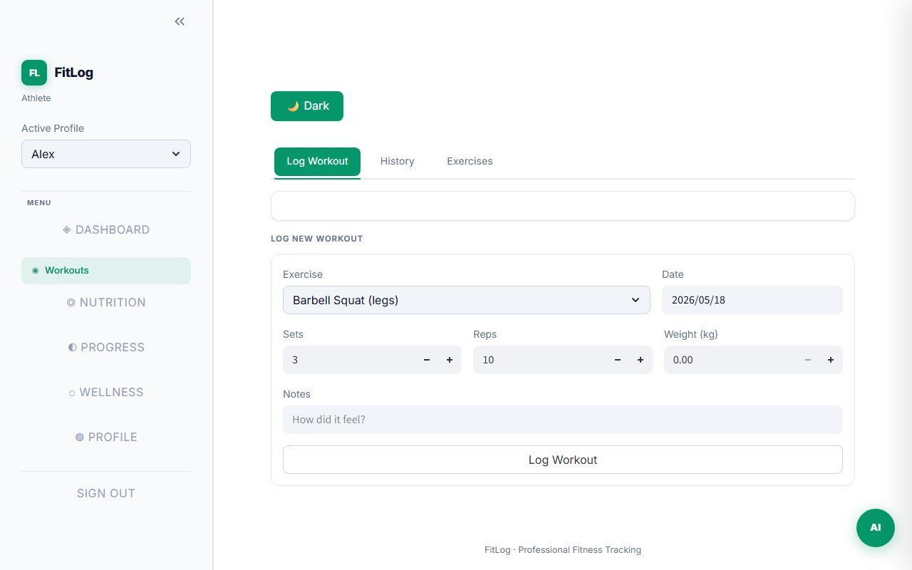
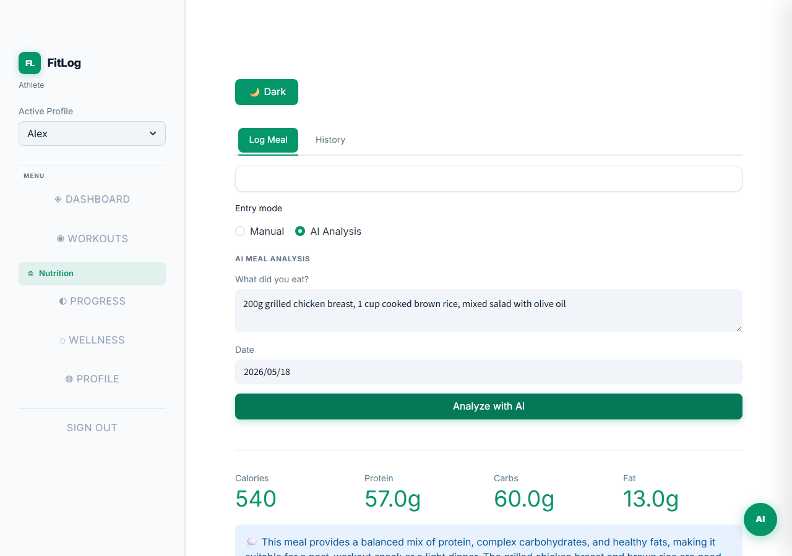
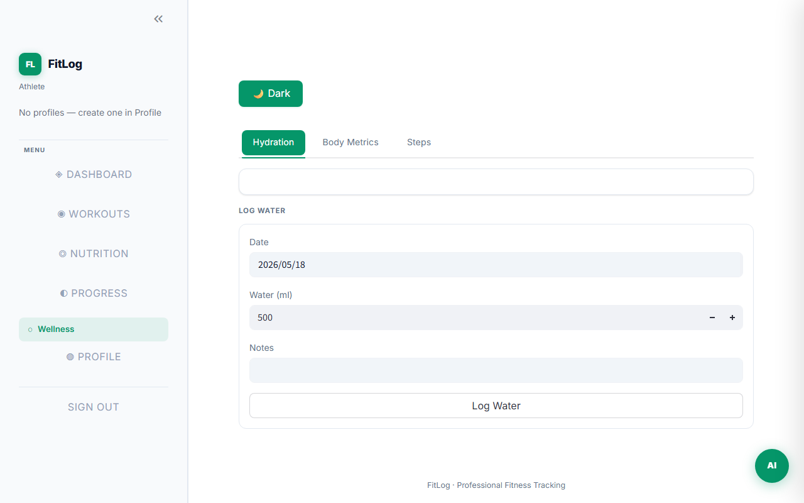
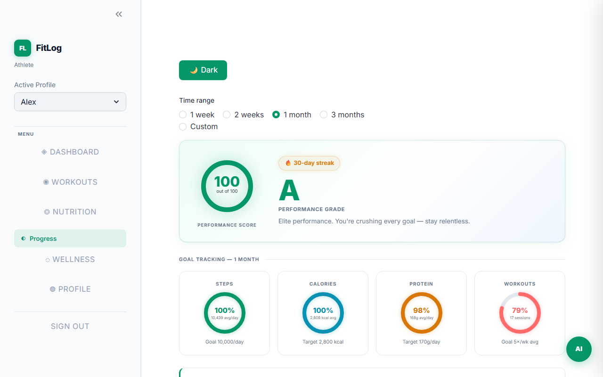
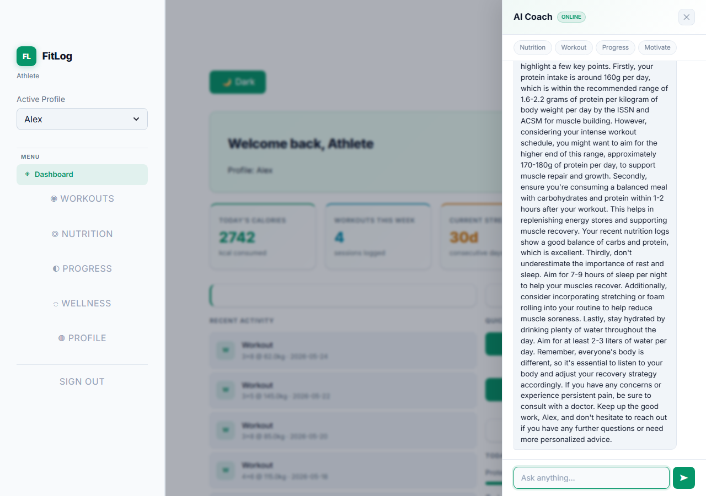

# FitLog

A personal fitness and nutrition tracking dashboard: Streamlit frontend with a **FastAPI** backend and **SQLite**. Track workouts, meals, sleep, hydration, body metrics, and daily steps — with an AI coach powered by Groq and optional Redis caching.

## Screenshots

### Login



### Dashboard



### Workouts



### Nutrition



### Wellness



### My Progress



### AI Coach



---

## Stack

| Layer | Details |
|---|---|
| **Frontend** | `frontend/app.py` — Streamlit dashboard; all pages in one file. |
| **Backend** | `app/` — **FastAPI**, **SQLModel**, **Uvicorn**; tables auto-created on startup. |
| **Database** | **SQLite** (dev) via `aiosqlite`; swap `DATABASE_URL` for PostgreSQL in production. |
| **AI Coach** | **Groq API** (`openai`-compatible client) — Llama 3.3 70B reads your profile and recent logs before answering. |
| **Cache** | **Redis** with automatic in-process fallback when Redis is unavailable. |
| **Auth** | JWT (`python-jose`) + bcrypt; 24-hour tokens, per-IP login rate limiting. |

## Requirements

- Python 3.12+
- [`uv`](https://docs.astral.sh/uv/) — `pip install uv`
- A free [Groq API key](https://console.groq.com)

## Quick start

```bash
git clone <repo-url>
cd FitLog
uv sync
cp .env.example .env   # then edit .env — set SECRET_KEY and GROQ_API_KEY
```

Start the backend:

```bash
uv run uvicorn app.main:app --reload
```

Start the frontend in a second terminal:

```bash
uv run streamlit run frontend/app.py
```

- **Dashboard:** [http://localhost:8501](http://localhost:8501)
- **API docs:** [http://localhost:8000/docs](http://localhost:8000/docs)

## Docker Compose

```bash
cp .env.example .env   # set SECRET_KEY, GROQ_API_KEY
docker compose up -d
```

## Default ports

| Service | Port |
|---|---|
| Frontend (Streamlit) | 8501 |
| Backend (Uvicorn) | 8000 |

## Environment

Copy `.env.example` to `.env` and fill in your keys before starting:

```bash
cp .env.example .env
```

| Variable | Required | Description |
|---|---|---|
| `SECRET_KEY` | yes | JWT signing key — generate with `python -c "import secrets; print(secrets.token_hex(32))"` |
| `GROQ_API_KEY` | yes | Groq API key from [console.groq.com](https://console.groq.com) |
| `DATABASE_URL` | no | Defaults to `sqlite+aiosqlite:///./fitlog.db` |
| `REDIS_URL` | no | Defaults to `redis://localhost:6379/0`; app runs without Redis |
| `ACCESS_TOKEN_EXPIRE_MINUTES` | no | Token lifetime — default `1440` (24 h) |
| `GROQ_MODEL` | no | Groq model ID — default `llama-3.3-70b-versatile` |

> **Security:** never commit `.env` or production secrets to GitHub.

## Features

### Workout Tracking (`app/routers/workout_logs.py`)

Log exercises, sets, reps, and weight per session. Each entry is linked to a fitness profile so multi-profile users keep their data separated. The exercise library is user-owned — seed it once and reuse across sessions.

**API endpoints:** `GET/POST/PUT/DELETE /logs/`

### Nutrition Logging (`app/routers/macros.py`)

Log daily macros manually or describe a meal in plain text and get calories, protein, carbs, and fat back from the AI. Results are cached per description so identical meals don't consume extra API quota.

**API endpoints:** `GET/POST/DELETE /macros/`, `POST /macros/analyze-food`

### Wellness Tracking (`app/routers/sleep.py`, `hydration.py`, `body_metrics.py`, `recovery.py`, `steps.py`)

Five separate trackers: sleep quality, daily hydration, body metrics (weight, body fat, waist, resting HR), recovery scores (energy, soreness, mood), and step counts. All share the same pattern — log an entry, view history, delete a record.

### AI Fitness Coach (`app/routers/ai_assistant.py`)

Floating chat button on every page. Before answering, the coach fetches your active profile, recent workout logs, and recent macro entries to give context-aware advice. Per-user rate limit of 30 calls per hour.

**API endpoint:** `POST /ai/chat`

### Analytics & Progress (`app/routers/analytics.py`)

Six analytics endpoints, all Redis-cached:

- Weekly workout volume (sets × reps × weight, by ISO week)
- Strength progression with estimated 1RM (Epley formula)
- Body metrics trend with BMI calculation
- Nutrition trend (daily macro totals)
- Wellness trend (sleep, hydration, composite recovery score)
- Dashboard summary (streak, avg calories, weight change, workouts this week)

### Fitness Profiles & Goals (`app/routers/profile.py`)

Multiple goal-based profiles per account (muscle, weight loss, endurance, maintenance). Each profile stores weight, height, age, gender, and goal. A protein target calculator returns evidence-based g/kg multipliers per goal. Goal targets (daily steps, calories, protein, weekly workouts) are stored per profile and drive the progress rings on the dashboard.

### JWT Authentication (`app/routers/auth.py`)

Register, login, and refresh token endpoints. Passwords are bcrypt-hashed. Login is rate-limited to 10 attempts per IP per 60 seconds. Refresh tokens expire after 7 days; access tokens after 24 hours (configurable).

## API (full list)

| Method | Path | Description |
|---|---|---|
| POST | `/auth/register` | Create account |
| POST | `/auth/login` | Get access + refresh tokens |
| POST | `/auth/refresh` | Exchange refresh token for new pair |
| GET/POST | `/profile/` | List or create fitness profiles |
| GET/PUT | `/profile/{id}/goals` | Read or update goal targets |
| GET | `/profile/{id}/protein-target` | Calculate daily protein target |
| GET/POST/DELETE | `/exercises/` | Manage exercise library |
| GET/POST/DELETE | `/logs/` | Workout log entries |
| GET/POST/DELETE | `/macros/` | Nutrition entries |
| POST | `/macros/analyze-food` | AI macro estimation from text |
| GET/POST/DELETE | `/sleep/` | Sleep entries |
| GET/POST/DELETE | `/hydration/` | Hydration entries |
| GET/POST/DELETE | `/body-metrics/` | Body metric entries |
| GET/POST/DELETE | `/recovery/` | Recovery entries |
| GET/POST/DELETE | `/steps/` | Step count entries |
| POST | `/ai/chat` | AI coach chat |
| GET | `/analytics/summary` | Dashboard summary |
| GET | `/analytics/workout-volume` | Weekly volume chart data |
| GET | `/analytics/strength-progress` | Per-exercise 1RM progression |
| GET | `/analytics/body-metrics-trend` | Weight and BMI over time |
| GET | `/analytics/nutrition-trend` | Daily macro totals over time |
| GET | `/analytics/wellness-trend` | Sleep, hydration, recovery over time |

Full interactive docs at `/docs` (Swagger UI) when the API is running.

## Development

- **Backend:** Uvicorn runs with `--reload` — changes apply immediately without restarting.
- **Frontend:** Streamlit auto-reloads on file save.
- **Tests:** each test runs against a fresh in-memory SQLite database — `fitlog.db` is never touched.

```bash
uv run pytest tests/ -v
```

## Repository layout

```
FitLog/
├── compose.yaml              # Redis + API + frontend orchestration
├── fitlog.http               # VS Code REST Client playground (EX1 bonus)
├── .env.example              # copy to .env and fill in keys
├── README.md
├── CLAUDE.md                 # project guide for AI pair-programming
├── docs/
│   ├── screenshots/          # UI images for this README
│   ├── EX3-notes.md          # orchestration, Redis trace, security rotation
│   └── runbooks/
│       └── compose.md        # launch, health check, Schemathesis, CI guide
├── app/
│   ├── main.py               # FastAPI app, middleware, lifespan
│   ├── db.py                 # SQLModel table definitions
│   ├── models.py             # Pydantic request / response schemas
│   ├── security.py           # JWT + bcrypt
│   ├── cache.py              # Redis with in-process fallback
│   ├── database.py           # async engine, session factory, migration shims
│   ├── exceptions.py         # domain exception hierarchy
│   ├── demo.py               # entry point: uv run python -m app.demo
│   └── routers/
│       ├── auth.py           # register, login, refresh, require_admin
│       ├── admin.py          # GET /admin/stats — admin role required
│       ├── exercises.py
│       ├── workout_logs.py
│       ├── macros.py         # manual logging + AI food analysis
│       ├── profile.py        # fitness profiles + goal targets
│       ├── ai_assistant.py   # POST /ai/chat — Groq Llama 3.3 70B
│       ├── analytics.py      # 6 Redis-cached analytics endpoints
│       ├── sleep.py
│       ├── hydration.py
│       ├── body_metrics.py
│       ├── recovery.py
│       └── steps.py
├── frontend/
│   ├── app.py                # Streamlit dashboard (all pages)
│   └── _ai_fab.py            # floating AI coach button
├── alembic/                  # async Alembic migrations
├── tests/                    # 85-test pytest suite
│   ├── conftest.py           # in-memory SQLite fixtures
│   ├── test_auth_security.py # JWT, role/scope, expired token tests
│   ├── test_refresh.py       # anyio async tests (Session 09)
│   ├── test_frontend.py      # Streamlit interface smoke test (EX2 bonus)
│   └── ...                   # feature tests per router
└── scripts/
    ├── demo.py               # end-to-end API walkthrough
    ├── demo.sh               # shell wrapper: bash scripts/demo.sh
    └── refresh.py            # async bulk cache refresh (Session 09)
```

## Demo Recording

[FitLog -Screen capture walkthrough — end-to-end flow](https://drive.google.com/file/d/1Cs7UaAmC05Vw2kAOirrXD2MXcfE8K2un/view?usp=sharing)

## AI Assistance

This project was developed with the help of **Claude Code** (Anthropic) as an AI pair-programming assistant.

**How it was used:**

- Generating boilerplate for FastAPI routers, SQLModel table definitions, and Pydantic schemas, then reviewing and adapting them to the fitness domain.
- Drafting pytest fixtures and test cases, which were verified by running the full suite locally (`uv run pytest tests/`).
- Suggesting the Redis-backed idempotency pattern for `scripts/refresh.py` (Session 09), which was then traced manually to confirm correct TTL behaviour.
- Writing first drafts of `docs/EX3-notes.md` and `docs/runbooks/compose.md`, which were reviewed for accuracy against the running stack.
- Generating the `.http` playground file, tested against the live API with VS Code REST Client.

**Verification approach:** Every AI-generated output was run locally before committing. Tests must pass (`85 passed`), the Docker stack must start cleanly (`docker compose up`), and the demo script must complete without errors (`bash scripts/demo.sh`).
